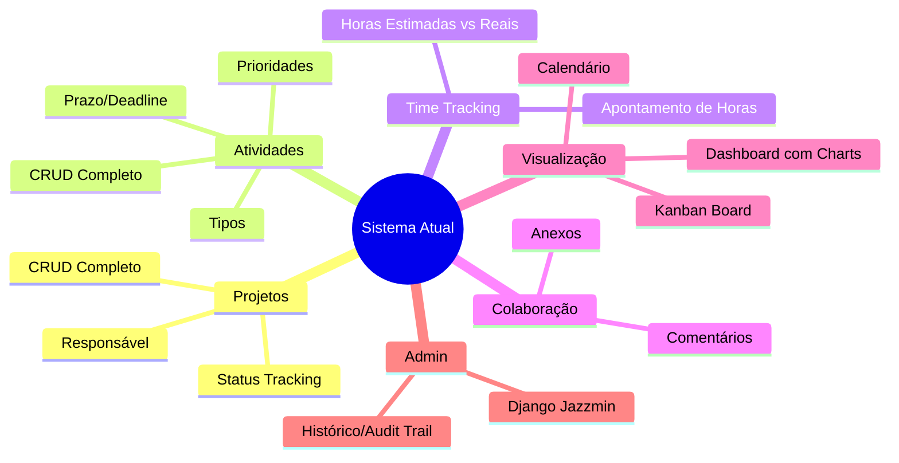
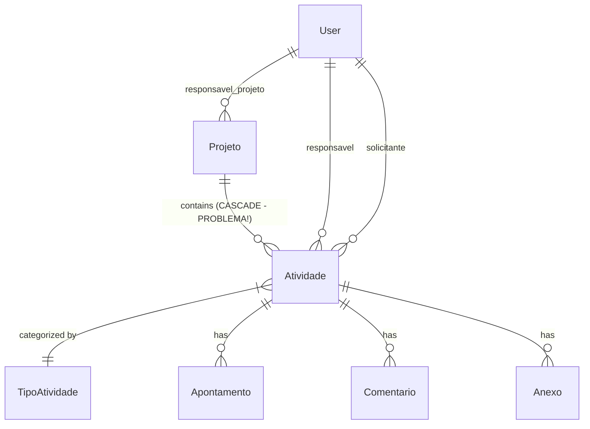
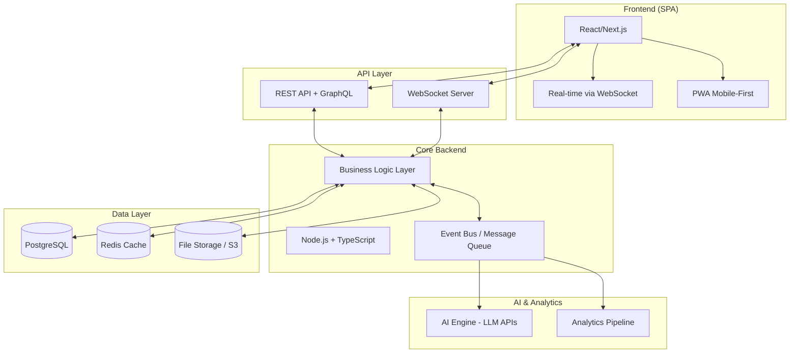
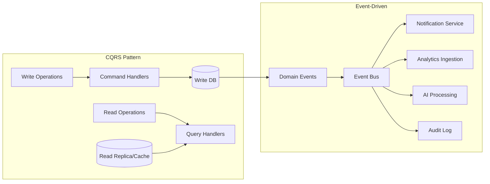
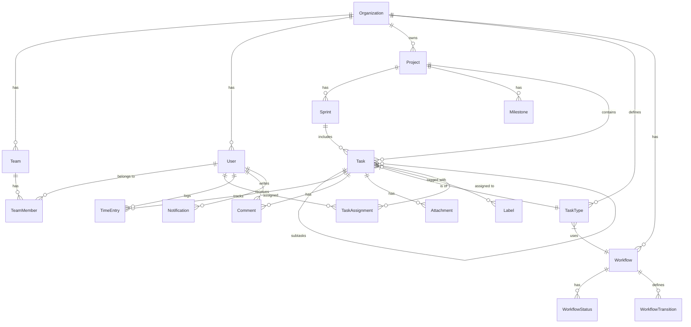
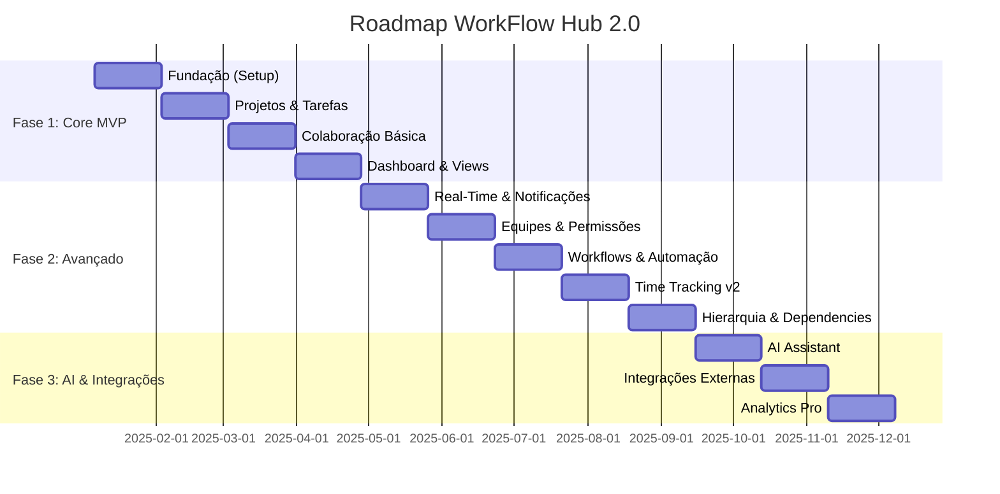

# 🚀 EVOLUTION SPECS: Sistema de Gerenciamento de Atividades v2.0

> **Documento Estratégico de Evolução de Produto**  
> Data: 29 de Dezembro de 2024  
> Autor: Análise CTO/Product Manager  
> Status: Proposta de Reinvenção Completa

---

## 📋 Sumário Executivo

O sistema atual é uma **Aplicação de Gerenciamento de Tarefas e Projetos** (Task/Project Management System) desenvolvida em Django, destinada à empresa CORE TI EXPERT. Funciona como um **mini-ERP de gestão de demandas** com foco em acompanhamento de atividades, apontamento de horas e visualização em dashboard/calendário.

**A Nova Visão 2.0** transforma este sistema em uma **Plataforma de Work Management Inteligente** com capacidades de colaboração em tempo real, automação via AI, e métricas preditivas – posicionando-o como uma solução competitiva no mercado de 2025/2026.

---

# PASSO 1: DIAGNÓSTICO DE PRODUTO & GAP ANALYSIS

## 1.1 Objetivo Central do Software

| Aspecto | Descrição |
|---------|-----------|
| **Tipo** | Sistema de Gerenciamento de Tarefas & Projetos (Task/Project Management) |
| **Domínio** | Operações internas de TI |
| **Usuários** | Equipe técnica da CORE TI EXPERT |
| **Problema que Resolve** | Organização, rastreamento e acompanhamento de atividades técnicas com foco em prazos, responsáveis e apontamento de horas |

### Core Features Atuais



---

## 1.2 Gap Analysis: O Que Está Faltando (Mercado 2025/2026)

### 🔴 Gaps Críticos

| Gap | Descrição | Impacto no Negócio |
|-----|-----------|-------------------|
| **Sem Real-Time** | Sistema 100% request-response. Nenhuma atualização live. | Usuários precisam dar refresh manualmente. Colaboração prejudicada. |
| **Sem Notificações** | Nenhum sistema de alertas (email, push, in-app) | Prazos são perdidos silenciosamente. Falta de visibilidade. |
| **Sem Multi-Tenancy** | Estrutura single-tenant fixa para CORE TI EXPERT | Impossível escalar para múltiplos clientes/departamentos. |
| **Permissões Básicas** | Usa modelo Django User padrão. Sem roles customizados. | Não há controle granular (quem vê o quê, quem edita o quê). |
| **Sem Mobile** | Apenas interface web tradicional | Equipe de campo não consegue acessar/atualizar em movimento. |
| **Sem Integrações** | Sistema isolado, sem webhooks ou APIs | Não conecta com Git, Slack, Email, Calendário, etc. |
| **Sem AI/Automação** | Zero inteligência artificial ou automações | Classificação manual, sem previsões, sem insights automáticos. |

### 🟠 Gaps de UX/Modernidade

| Gap | Detalhe |
|-----|---------|
| **Frontend Monolítico** | Templates Django server-rendered. Experiência lenta e não-reactiva. |
| **Sem Drag & Drop** | Kanban existe mas interação é básica. |
| **Filtros Limitados** | Dashboard tem cards clicáveis mas falta busca avançada/salva filtros. |
| **Relatórios Básicos** | Apenas gráficos pré-definidos. Sem export, sem relatórios customizáveis. |
| **Sem Dark Mode Toggle** | Dark mode está fixo no admin mas não há toggle de preferência. |

---

## 1.3 Crítica à Modelagem de Dados Atual

### Problemas Identificados



### ❌ Pontos Críticos na Modelagem

#### 1. **Cascade Delete Perigoso**
```python
# PROBLEMA: models.py linha 109
projeto = models.ForeignKey(
    Projeto, 
    on_delete=models.CASCADE,  # ⚠️ Deletar projeto apaga TUDO
    null=True, blank=True
)
```
> **Risco**: Usuário deleta projeto e perde todo histórico de atividades, apontamentos, comentários.  
> **Solução 2.0**: Usar soft-delete com campo `is_archived` ou `deleted_at`.

#### 2. **Status como String Choices (Não-Extensível)**
```python
STATUS_CHOICES = [
    ('PENDENTE', 'Pendente'),
    ('EM_ANDAMENTO', 'Em Andamento'),
    # ... hardcoded
]
```
> **Problema**: Adicionar/remover status requer migração de banco e deploy.  
> **Solução 2.0**: Tabela separada `StatusConfig` ou enum dinâmico com workflow engine.

#### 3. **Falta de Hierarquia em Atividades**
- Não há conceito de **sub-tarefas** ou **atividades filhas**.
- Não há **épicos** ou **milestones**.
- Impede decomposição de trabalho complexo.

#### 4. **TipoAtividade é Simplista Demais**
- Apenas um campo `nome`. 
- Não há cor, ícone, SLA padrão, ou comportamento associado.

#### 5. **Relacionamento Usuário-Atividade Limitado**
- Apenas `responsavel` e `solicitante` (1:1 cada).
- Não suporta **múltiplos responsáveis** nem **equipes**.
- Não há conceito de **watchers/observers**.

#### 6. **Anexo sem Metadados**
```python
class Anexo(models.Model):
    arquivo = models.FileField(upload_to='anexos_atividades/%Y/%m/')
```
> **Faltando**: tipo MIME, tamanho, hash/checksum, preview thumbnail, virus scan status.

#### 7. **Histórico via simple_history é Black-Box**
- Funciona bem para auditoria básica.
- Mas não é consultável facilmente para relatórios de mudanças.
- Não há eventos de domínio (Event Sourcing) para integrações.

---

# PASSO 2: PROPOSTA DA "VERSÃO 2.0" (A Nova Visão)

## 2.1 O Conceito do Novo Sistema

> **WorkFlow Hub**: Uma Plataforma de Gestão de Trabalho Inteligente com colaboração em tempo real, automações baseadas em IA, e analytics preditivos.

### Pilares da Nova Arquitetura



---

## 2.2 Killer Features - O Diferencial Competitivo

### 🌟 Feature 1: Real-Time Collaboration (Colaboração em Tempo Real)

**O Problema Hoje**: Usuários não sabem quando colegas atualizam tarefas.

**A Solução 2.0**:
- WebSocket permanente para todos os clientes conectados.
- Atualizações live em dashboards, cards, e listas.
- Presença: ver quem está online e visualizando a mesma tarefa.
- Cursor tracking em campos de edição (estilo Google Docs).

```typescript
// Exemplo de evento real-time
interface TaskUpdatedEvent {
  eventType: 'TASK_UPDATED';
  taskId: string;
  changes: {
    field: 'status' | 'assignee' | 'priority' | 'dueDate';
    oldValue: unknown;
    newValue: unknown;
  }[];
  actor: {
    id: string;
    name: string;
    avatar: string;
  };
  timestamp: Date;
}
```

---

### 🌟 Feature 2: AI-Powered Smart Assistant

**O Problema Hoje**: Classificação manual, nenhuma inteligência preditiva.

**A Solução 2.0**:
- **Auto-Categorização**: AI sugere Tipo, Prioridade e Projeto baseado no título/descrição.
- **Estimativa de Esforço**: Modelo treinado sugere horas estimadas baseado em histórico.
- **Detecção de Deadline Risk**: Alerta proativo quando SLA está em risco.
- **Resumo Automático**: Gera resumo de comentários e atividades da semana.
- **Natural Language Actions**: "Mover todas as minhas tarefas em atraso para próxima sprint".

```typescript
interface AIAssistantCapabilities {
  suggestCategory(title: string, description: string): Promise<CategorySuggestion>;
  estimateEffort(task: Task): Promise<EffortEstimate>;
  detectRisks(project: Project): Promise<RiskReport[]>;
  generateWeeklySummary(userId: string): Promise<string>;
  parseNaturalLanguageCommand(input: string): Promise<Action[]>;
}
```

---

### 🌟 Feature 3: Workflow Automation Engine

**O Problema Hoje**: Todas as transições são manuais.

**A Solução 2.0**:
- **Triggers Visuais**: "Quando status mudar para Concluído, notificar solicitante".
- **SLAs Automáticos**: Escalar prioridade se deadline < 2 dias.
- **Checklists Obrigatórios**: Bloquear conclusão sem checklist preenchido.
- **Integração com Git**: Mover task para "Em Review" quando PR for aberto linkando a task.

```typescript
interface AutomationRule {
  id: string;
  name: string;
  trigger: {
    type: 'STATUS_CHANGE' | 'FIELD_CHANGE' | 'TIME_BASED' | 'EXTERNAL_WEBHOOK';
    conditions: Condition[];
  };
  actions: {
    type: 'UPDATE_FIELD' | 'SEND_NOTIFICATION' | 'CREATE_TASK' | 'CALL_WEBHOOK';
    params: Record<string, unknown>;
  }[];
  isActive: boolean;
}
```

---

### 🌟 Feature 4: Advanced Analytics & Reporting

**O Problema Hoje**: Gráficos fixos, sem insights acionáveis.

**A Solução 2.0**:
- **Dashboards Customizáveis**: Drag & drop de widgets.
- **Métricas de Time Tracking Avançadas**: 
  - Burndown/Burnup charts por projeto/sprint.
  - Velocity tracking.
  - Cycle time e Lead time.
- **Relatórios de Produtividade por Equipe/Pessoa**.
- **Export para PDF/Excel/CSV** com templates customizáveis.
- **Scheduled Reports**: Envio automático semanal por email.

---

### 🌟 Feature 5: Multi-Platform & Mobile-First PWA

**O Problema Hoje**: Apenas web desktop, sem suporte mobile.

**A Solução 2.0**:
- **PWA (Progressive Web App)** instalável em qualquer dispositivo.
- **Offline Mode**: Criar/editar tarefas offline com sync automático.
- **Push Notifications** nativas.
- **Quick Actions** via widget de notificação.
- **Responsive Design** otimizado para telas de 320px a 4K.

---

## 2.3 Stack Tecnológica Ideal

### Justificativa de Escolhas

| Componente | Tecnologia Recomendada | Justificativa |
|------------|----------------------|---------------|
| **Frontend** | **Next.js 15 + React 19** | SSR/SSG híbrido, React Server Components, excelente DX, grande ecossistema. |
| **UI Components** | **Shadcn/ui + Tailwind CSS** | Componentes modernos, alta customização, performance excelente. |
| **State Management** | **TanStack Query + Zustand** | Cache automático de API, estados globais simples. |
| **Backend Runtime** | **Node.js 22 LTS + Bun** | Performance, TypeScript nativo, excelente para real-time. |
| **API Framework** | **Hono ou Fastify + tRPC** | Type-safety end-to-end, mínimo boilerplate, alta performance. |
| **ORM/Database** | **PostgreSQL + Drizzle ORM** | Relacional robusto, tipagem forte, migrations automáticas. |
| **Real-Time** | **Socket.io ou PartyKit** | WebSockets simplificados, rooms, presença. |
| **Message Queue** | **BullMQ (Redis)** | Jobs assíncronos, retries, eventos de domínio. |
| **Cache** | **Redis / Upstash** | Cache distribuído, sessions, pub/sub. |
| **AI Integration** | **OpenAI API / Claude API / Local LLM** | Flexibilidade, custo controlado, opção self-hosted. |
| **File Storage** | **S3-compatible (MinIO self-hosted ou AWS S3)** | Escalável, presigned URLs, lifecycle policies. |
| **Auth** | **NextAuth.js v5 / Clerk** | Múltiplos providers, RBAC integrado, sessions seguras. |
| **Observability** | **OpenTelemetry + Grafana** | Tracing distribuído, métricas, logs centralizados. |

### Por que NÃO Django para v2.0?

| Limitação Django | Impacto |
|-----------------|---------|
| ORM síncrono por padrão | Bloqueio de I/O em operações pesadas |
| Templates server-side | Experiência de usuário não-reativa |
| Ecossistema WebSocket imaturo | Channels funciona mas é complexo |
| Tipagem opcional (Python) | Mais bugs em runtime, refatoração arriscada |
| Deployment costoso | Python mais pesado que Node em serverless |

> **Nota**: Django é excelente para MVPs e projetos menores, mas para uma plataforma colaborativa real-time com AI, o ecossistema Node/TypeScript oferece melhor ajuste.

---

## 2.4 Melhorias de Arquitetura

### Padrões Modernos Propostos



### Decisões Arquiteturais

| Padrão | Aplicação | Benefício |
|--------|-----------|-----------|
| **CQRS** | Separação de leitura/escrita para dashboards | Dashboards rápidos sem impactar operações |
| **Event Sourcing (Parcial)** | Log de alterações críticas | Auditoria completa, replay de estados |
| **Repository Pattern** | Abstração de acesso a dados | Testabilidade, swap de database facilitado |
| **Hexagonal Architecture** | Ports & Adapters para integrações | Adicionar Slack, Jira, Git sem mudar core |
| **Feature Flags** | Rollout gradual de funcionalidades | Lançar AI para beta testers primeiro |

---

# PASSO 3: FEATURE SET EXPANDIDO & SCHEMA DE DADOS

## 3.1 Feature Set Completo v2.0

### Funcionalidades Atuais (Melhoradas)

| Feature Atual | Melhoria v2.0 |
|---------------|---------------|
| CRUD Atividades | + Sub-tarefas, Templates, Recorrência |
| CRUD Projetos | + Boards, Sprints, Milestones, Metas |
| Apontamento de Horas | + Timer automático, integração com calendário |
| Comentários | + Mentions (@user), Rich text, Threads |
| Anexos | + Preview inline, Drag & Drop, Limits & Virus Scan |
| Dashboard | + Widgets customizáveis, Dark/Light toggle |
| Calendário | + Sync bidirecional com Google/Outlook |
| Kanban | + Drag & Drop real, Swimlanes, WIP Limits |
| Admin | Substituído por UI nativa self-service |
| Histórico | + Timeline visual, Comparação de versões |

### Novas Funcionalidades

| Feature | Descrição |
|---------|-----------|
| **🔔 Notification Center** | In-app, Email, Push, Digest semanal |
| **👥 Teams & Roles** | Equipes, permissões granulares, guests |
| **🎯 Goals & OKRs** | Vincular tarefas a objetivos maiores |
| **📊 Custom Reports** | Builder de relatórios drag & drop |
| **🔗 Integrations Hub** | Slack, Git, Jira, Zapier |
| **🤖 AI Assistant** | Chat command, automações inteligentes |
| **📱 Mobile PWA** | App instalável com offline mode |
| **⏱️ Live Timer** | Cronômetro com tracking automático |
| **🏷️ Custom Fields** | Campos dinâmicos por tipo de tarefa |
| **📋 Templates** | Templates de projetos e tarefas |

---

## 3.2 Novo Schema de Dados (Otimizado)

### Entidades Principais (TypeScript Interfaces)

```typescript
// ====================
// CORE ENTITIES
// ====================

interface Organization {
  id: string; // UUID
  name: string;
  slug: string; // URL-friendly identifier
  logo?: string;
  settings: OrganizationSettings;
  subscription: SubscriptionTier;
  createdAt: Date;
  updatedAt: Date;
}

interface Team {
  id: string;
  organizationId: string;
  name: string;
  description?: string;
  color: string; // Hex color for visual identification
  members: TeamMember[];
  isDefault: boolean;
  createdAt: Date;
}

interface TeamMember {
  userId: string;
  teamId: string;
  role: 'ADMIN' | 'MEMBER' | 'VIEWER';
  joinedAt: Date;
}

interface User {
  id: string;
  organizationId: string;
  email: string;
  name: string;
  avatarUrl?: string;
  role: GlobalRole;
  timezone: string;
  preferences: UserPreferences;
  isActive: boolean;
  lastActiveAt?: Date;
  createdAt: Date;
}

type GlobalRole = 'OWNER' | 'ADMIN' | 'MEMBER' | 'GUEST';

interface UserPreferences {
  theme: 'LIGHT' | 'DARK' | 'SYSTEM';
  language: 'pt-BR' | 'en-US' | 'es';
  notifications: NotificationPreferences;
  defaultView: 'LIST' | 'KANBAN' | 'CALENDAR' | 'TIMELINE';
}

// ====================
// PROJECT MANAGEMENT
// ====================

interface Project {
  id: string;
  organizationId: string;
  teamId?: string; // Optional team ownership
  
  // Basic Info
  name: string;
  description?: string;
  color: string;
  icon: string; // Emoji or icon identifier
  
  // Status & Workflow
  status: ProjectStatus;
  visibility: 'PUBLIC' | 'PRIVATE' | 'TEAM_ONLY';
  
  // Dates
  startDate?: Date;
  targetEndDate?: Date;
  actualEndDate?: Date;
  
  // Ownership
  ownerId: string; // User ID
  
  // Settings
  defaultTaskType?: string;
  workflowId?: string; // Custom workflow
  
  // Metadata
  isArchived: boolean;
  archivedAt?: Date;
  createdAt: Date;
  updatedAt: Date;
}

type ProjectStatus = 
  | 'PLANNING' 
  | 'ACTIVE' 
  | 'ON_HOLD' 
  | 'COMPLETED' 
  | 'CANCELLED';

interface Sprint {
  id: string;
  projectId: string;
  name: string;
  goal?: string;
  startDate: Date;
  endDate: Date;
  status: 'PLANNED' | 'ACTIVE' | 'COMPLETED';
  velocity?: number; // Story points completed
  createdAt: Date;
}

interface Milestone {
  id: string;
  projectId: string;
  name: string;
  description?: string;
  dueDate: Date;
  status: 'PENDING' | 'COMPLETED' | 'MISSED';
  completedAt?: Date;
}

// ====================
// TASK MANAGEMENT
// ====================

interface Task {
  id: string;
  projectId: string;
  sprintId?: string;
  
  // Hierarchy
  parentTaskId?: string; // For sub-tasks
  
  // Basic Info
  title: string;
  description?: string; // Rich text / Markdown
  
  // Classification
  typeId: string; // TaskType reference
  priorityLevel: PriorityLevel;
  status: string; // Dynamic, from workflow
  
  // Assignment
  assignees: TaskAssignment[];
  reporterId: string; // Who created/requested
  watchers: string[]; // User IDs for notifications
  
  // Dates
  startDate?: Date;
  dueDate?: Date;
  completedAt?: Date;
  
  // Effort
  estimatedHours?: number;
  storyPoints?: number;
  
  // Custom Fields
  customFields: Record<string, CustomFieldValue>;
  
  // Tags/Labels
  labels: string[]; // Label IDs
  
  // Recurrence
  recurrence?: RecurrenceRule;
  
  // Metadata
  order: number; // For manual sorting
  isArchived: boolean;
  createdAt: Date;
  updatedAt: Date;
}

type PriorityLevel = 'CRITICAL' | 'HIGH' | 'MEDIUM' | 'LOW' | 'NONE';

interface TaskAssignment {
  taskId: string;
  userId: string;
  role: 'PRIMARY' | 'SECONDARY' | 'REVIEWER';
  assignedAt: Date;
  assignedBy: string;
}

interface TaskType {
  id: string;
  organizationId: string;
  name: string;
  description?: string;
  icon: string;
  color: string;
  defaultWorkflowId: string;
  customFieldDefinitions: CustomFieldDefinition[];
  isDefault: boolean;
  isActive: boolean;
}

interface Label {
  id: string;
  organizationId: string;
  name: string;
  color: string;
  description?: string;
}

// ====================
// WORKFLOW ENGINE
// ====================

interface Workflow {
  id: string;
  organizationId: string;
  name: string;
  description?: string;
  statuses: WorkflowStatus[];
  transitions: WorkflowTransition[];
  isDefault: boolean;
}

interface WorkflowStatus {
  id: string;
  name: string;
  category: 'TODO' | 'IN_PROGRESS' | 'DONE' | 'CANCELLED';
  color: string;
  order: number;
  isInitial: boolean;
  isFinal: boolean;
}

interface WorkflowTransition {
  id: string;
  fromStatusId: string;
  toStatusId: string;
  name?: string;
  conditions?: TransitionCondition[];
  actions?: TransitionAction[];
}

// ====================
// TIME TRACKING
// ====================

interface TimeEntry {
  id: string;
  taskId: string;
  userId: string;
  
  // Time
  startedAt: Date;
  endedAt?: Date; // Null if timer is running
  durationMinutes: number;
  
  // Details
  description?: string;
  isBillable: boolean;
  
  // Source
  source: 'MANUAL' | 'TIMER' | 'CALENDAR_SYNC';
  
  createdAt: Date;
  updatedAt: Date;
}

// ====================
// COLLABORATION
// ====================

interface Comment {
  id: string;
  taskId: string;
  authorId: string;
  
  // Content
  content: string; // Rich text/Markdown
  mentions: string[]; // User IDs mentioned
  
  // Threading
  parentCommentId?: string;
  
  // Reactions
  reactions: Reaction[];
  
  // Edit history
  isEdited: boolean;
  editedAt?: Date;
  
  createdAt: Date;
}

interface Reaction {
  userId: string;
  emoji: string;
  createdAt: Date;
}

interface Attachment {
  id: string;
  taskId?: string;
  commentId?: string;
  
  // File info
  fileName: string;
  fileSize: number;
  mimeType: string;
  storageKey: string; // S3 key or path
  
  // Processing
  thumbnailUrl?: string;
  isScanned: boolean;
  scanResult?: 'CLEAN' | 'INFECTED' | 'PENDING';
  
  // Metadata
  uploadedById: string;
  createdAt: Date;
}

// ====================
// NOTIFICATIONS
// ====================

interface Notification {
  id: string;
  userId: string;
  
  // Content
  type: NotificationType;
  title: string;
  body: string;
  
  // Reference
  entityType: 'TASK' | 'PROJECT' | 'COMMENT';
  entityId: string;
  
  // Actor
  actorId?: string;
  
  // Status
  isRead: boolean;
  readAt?: Date;
  
  // Delivery
  channels: ('IN_APP' | 'EMAIL' | 'PUSH')[];
  
  createdAt: Date;
}

type NotificationType = 
  | 'TASK_ASSIGNED'
  | 'TASK_MENTIONED'
  | 'TASK_DUE_SOON'
  | 'TASK_OVERDUE'
  | 'COMMENT_ADDED'
  | 'STATUS_CHANGED'
  | 'PROJECT_UPDATED';

// ====================
// AUTOMATION
// ====================

interface AutomationRule {
  id: string;
  organizationId: string;
  projectId?: string; // Null = org-wide
  
  name: string;
  description?: string;
  
  trigger: AutomationTrigger;
  conditions: AutomationCondition[];
  actions: AutomationAction[];
  
  isActive: boolean;
  executionCount: number;
  lastExecutedAt?: Date;
  
  createdById: string;
  createdAt: Date;
}

interface AutomationTrigger {
  type: 
    | 'TASK_CREATED'
    | 'TASK_UPDATED'
    | 'STATUS_CHANGED'
    | 'ASSIGNEE_CHANGED'
    | 'DUE_DATE_APPROACHING'
    | 'COMMENT_ADDED'
    | 'SCHEDULE'; // Cron-based
  config: Record<string, unknown>;
}

interface AutomationAction {
  type:
    | 'UPDATE_FIELD'
    | 'ADD_LABEL'
    | 'ASSIGN_USER'
    | 'SEND_NOTIFICATION'
    | 'CREATE_TASK'
    | 'CALL_WEBHOOK'
    | 'MOVE_TO_PROJECT';
  config: Record<string, unknown>;
}

// ====================
// AUDIT & EVENTS
// ====================

interface AuditLog {
  id: string;
  organizationId: string;
  
  // Actor
  userId: string;
  userAgent?: string;
  ipAddress?: string;
  
  // Action
  action: string; // e.g., 'task.created', 'task.status_changed'
  entityType: string;
  entityId: string;
  
  // Changes (for updates)
  changes?: {
    field: string;
    before: unknown;
    after: unknown;
  }[];
  
  // Metadata
  metadata?: Record<string, unknown>;
  
  timestamp: Date;
}
```

### Diagrama de Relacionamentos



---

## 3.3 Comparativo: Schema Atual vs Novo

| Entidade Atual | Limitação | Solução v2.0 |
|---------------|-----------|--------------|
| `Projeto` | Sem hierarquia, sem sprints | `Project` + `Sprint` + `Milestone` |
| `Atividade` | Sem sub-tarefas, assignee único | `Task` com `parentTaskId` e múltiplos `assignees` |
| `TipoAtividade` | Só nome | `TaskType` com workflow, cores, campos customizados |
| `Apontamento` | Só registro manual | `TimeEntry` com timer live, billable, calendar sync |
| `Comentario` | Texto simples | `Comment` com mentions, threads, reactions, rich text |
| `Anexo` | Sem metadados | `Attachment` com scan, thumbnail, preview |
| (inexistente) | - | `Notification`, `AutomationRule`, `AuditLog`, `Workflow` |

---

# PASSO 4: ROADMAP DE DESENVOLVIMENTO

## Fase 1: O Core (MVP da Nova Versão)
**Duração Estimada: 8-10 semanas**

### Sprint 1-2: Fundação
- [ ] Setup do monorepo (Turborepo ou Nx)
- [ ] Configuração Next.js + TypeScript
- [ ] Configuração PostgreSQL + Drizzle ORM
- [ ] Migração inicial do schema básico
- [ ] Autenticação (NextAuth.js)
- [ ] UI Kit base (Shadcn/ui + Tailwind)

### Sprint 3-4: Gestão de Projetos & Tarefas
- [ ] CRUD de Projetos
- [ ] CRUD de Tarefas (sem sub-tarefas ainda)
- [ ] Lista, Filtros, Busca
- [ ] Kanban board básico (drag & drop)
- [ ] Status workflow simples

### Sprint 5-6: Colaboração Básica
- [ ] Comentários (sem threads)
- [ ] Anexos com upload
- [ ] Histórico de alterações (audit log)
- [ ] Apontamento de horas manual

### Sprint 7-8: Dashboard & Visualizações
- [ ] Dashboard com widgets fixos
- [ ] Calendário com eventos
- [ ] Relatórios básicos (gráficos)

### Entregável Fase 1:
> **Produto funcional equivalente ao atual, porém moderno, responsivo e preparado para escalar.**

---

## Fase 2: Features Avançadas
**Duração Estimada: 10-12 semanas**

### Sprint 9-10: Real-Time & Notificações
- [ ] WebSocket infrastructure (Socket.io)
- [ ] Live updates em tasks e boards
- [ ] Notification center in-app
- [ ] Email notifications (templates)
- [ ] Push notifications (PWA)

### Sprint 11-12: Equipes & Permissões
- [ ] Model de Teams
- [ ] RBAC granular
- [ ] Convites e guests
- [ ] Visibility controls

### Sprint 13-14: Workflows & Automação
- [ ] Custom workflows (UI builder)
- [ ] Automation engine
- [ ] Templates de tarefas
- [ ] Recorrência

### Sprint 15-16: Time Tracking Avançado
- [ ] Timer live (start/stop)
- [ ] Relatórios de horas
- [ ] Integração com calendário
- [ ] Billable tracking

### Sprint 17-18: Sub-tarefas & Hierarquia
- [ ] Sub-tasks
- [ ] Checklists
- [ ] Dependencies entre tasks
- [ ] Gantt chart view

---

## Fase 3: AI & Integrações (Diferenciação)
**Duração Estimada: 8-10 semanas**

### Sprint 19-20: AI Assistant
- [ ] Integração com LLM (OpenAI/Claude)
- [ ] Auto-categorização
- [ ] Estimativa de esforço inteligente
- [ ] Natural language actions

### Sprint 21-22: Integrações
- [ ] Slack notifications & commands
- [ ] GitHub/GitLab integration
- [ ] Webhook framework
- [ ] Zapier connector

### Sprint 23-24: Analytics Avançados
- [ ] Custom report builder
- [ ] Burndown/Burnup charts
- [ ] Velocity tracking
- [ ] Export & scheduled reports

---

## Diagrama de Roadmap Visual



---

# 📌 Conclusão

Este documento apresenta uma visão completa para transformar o sistema atual de gerenciamento de atividades em uma **plataforma de work management de classe mundial**.

## Principais Takeaways

1. **O sistema atual funciona**, mas está limitado tecnologicamente e funcionalmente para 2025.

2. **A stack Node.js/TypeScript/Next.js** oferece melhor ajuste para as necessidades de real-time, AI e mobile.

3. **As 5 Killer Features** (Real-time, AI, Automação, Analytics, Mobile PWA) criarão diferenciação competitiva significativa.

4. **O novo schema de dados** resolve todas as limitações identificadas e permite extensibilidade futura.

5. **O roadmap em 3 fases** permite entrega incremental de valor, começando com um MVP equivalente ao atual em ~10 semanas.

---

> **Próximos Passos Recomendados:**
> 1. Validar prioridades de features com stakeholders.
> 2. Definir orçamento e recursos disponíveis.
> 3. Decidir entre migração gradual vs. reimplementação completa.
> 4. Iniciar Fase 1 com setup de infraestrutura.

---

*Documento gerado em 29/12/2024 por análise automatizada de CTO/Product Manager.*
